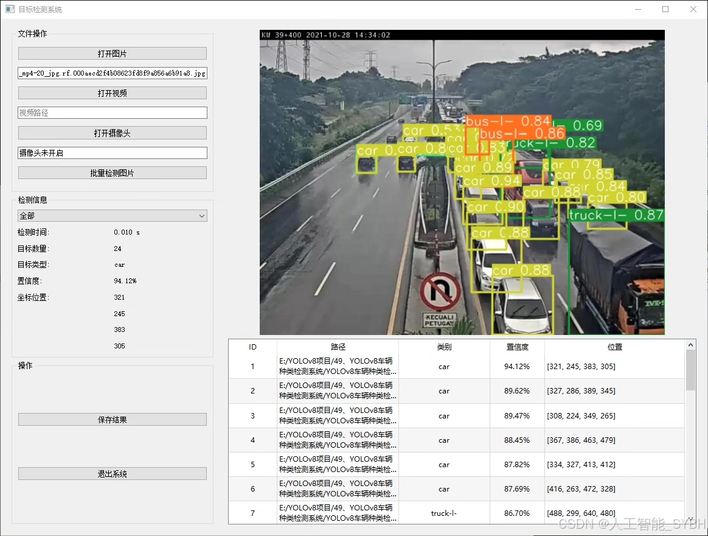
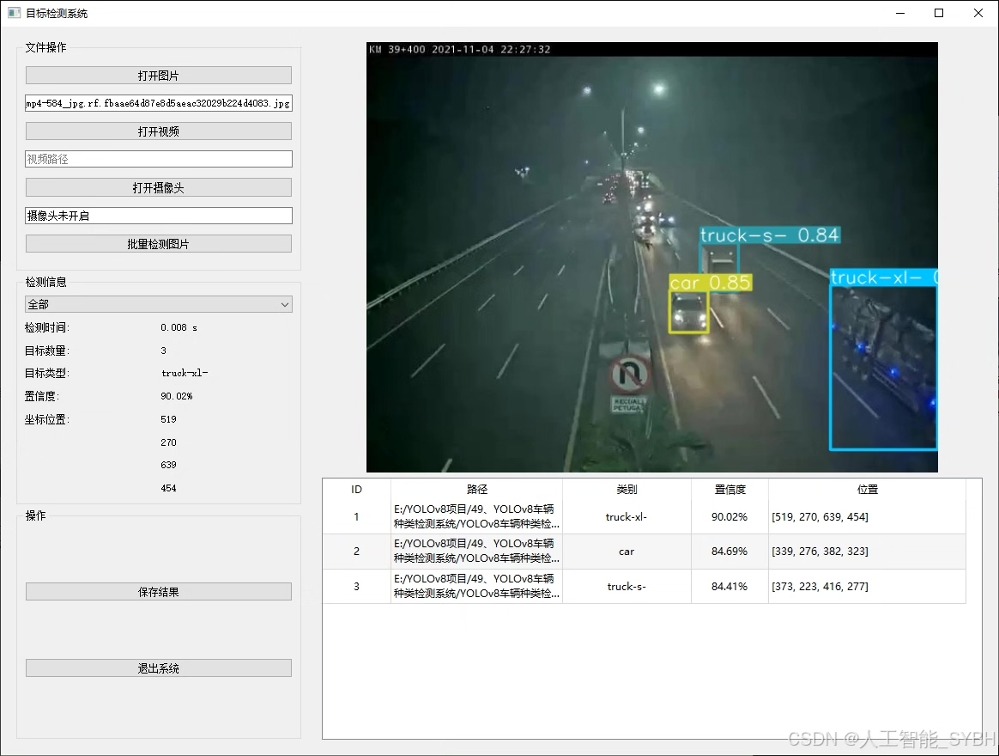
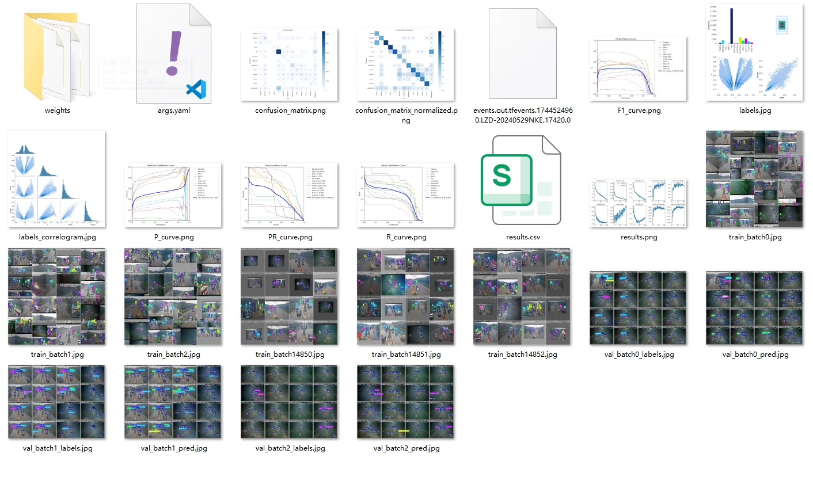
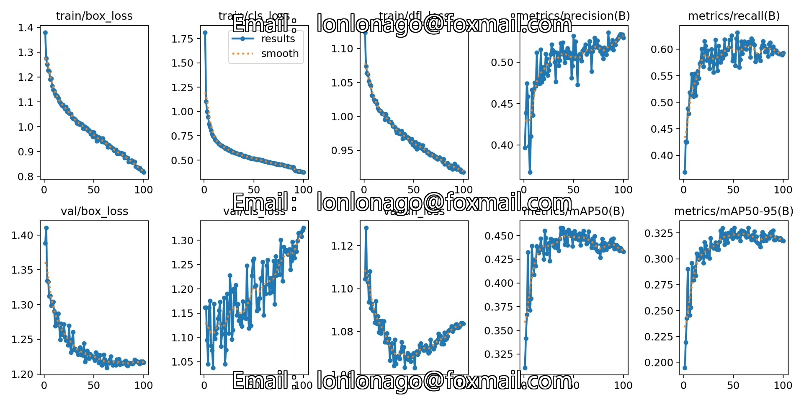
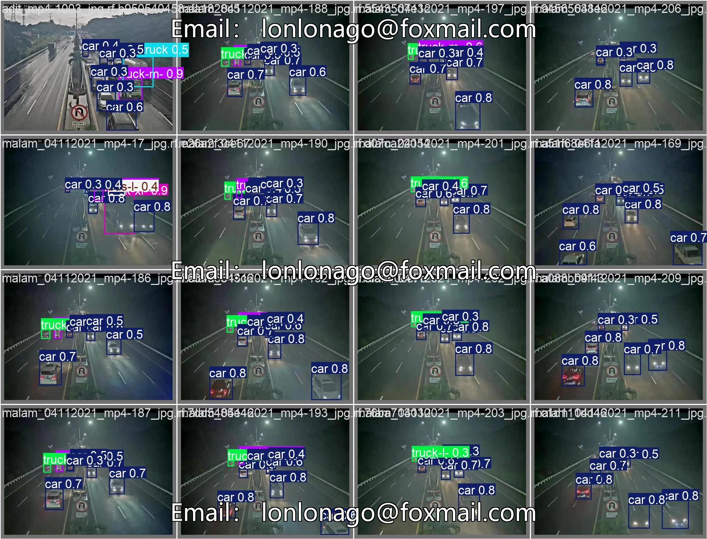
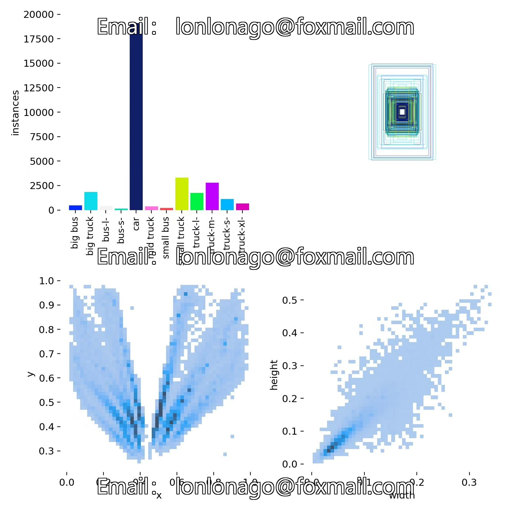
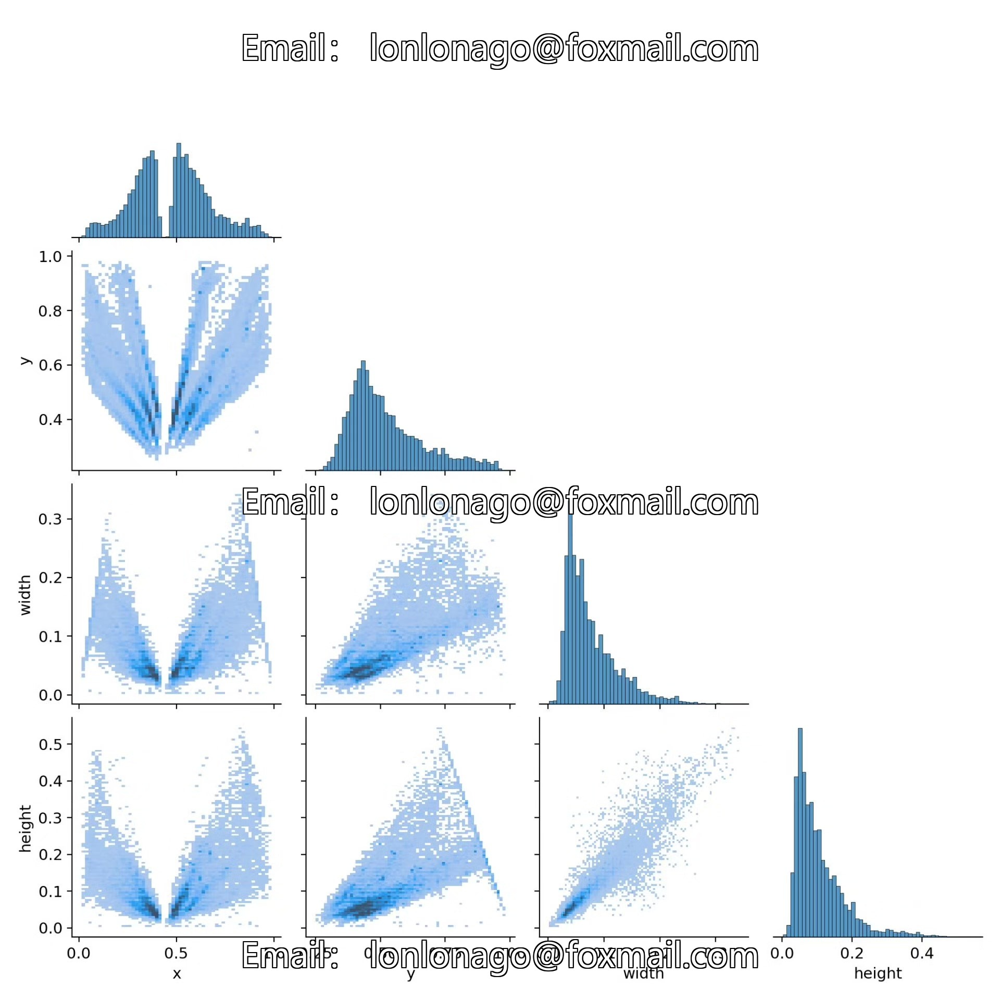
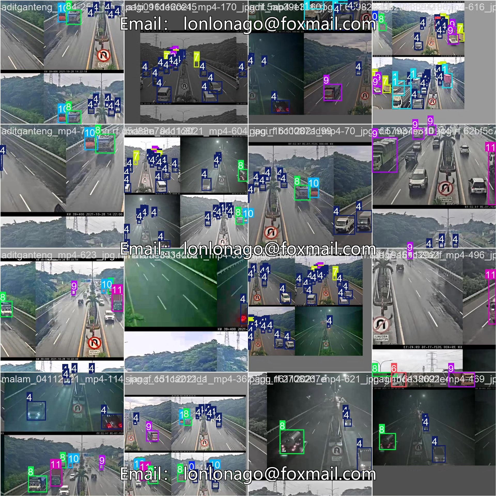

# Vehicle Detection System Based on YOLOv8 Deep Learning (YOLOv8+Y)

## Body

Based on the YOLOv8 deep learning framework, this project innovatively utilizes YOLOv8 to develop a high-precision intelligent vehicle classification detection system. The system can accurately identify 12 common vehicle types, including: large buses (big bus), large trucks (big truck), different sizes of buses (bus-l-, bus-s-), cars (car), medium trucks (mid truck), small buses (small bus), small trucks, and five specifications of freight trucks (truck-l-, truck-m-, truck-s-, truck-xl-). Based on a rich dataset containing 2634 training images, 966 validation images, and 458 test images, this system achieves real-time and accurate recognition and classification of various types of vehicles in complex traffic scenarios.

The company's products have obtained YOLO official commercial license certification.

Package after-sales service: After payment, we will provide WeChat ID for instant questions and answers.

Environment configuration: A tutorial on environment configuration will be provided, with WeChat available for Q&A.

Remote installation service: If you need remote configuration, an additional fee of 69 is required, with all fees refunded if the configuration fails (only refunding installation fees for older computers).

Retraining dataset: Once the environment is configured, you can train on your own computer. If you need us to retrain, just pay 69 plus computing power fees (2.5 yuan/hour).

Full after-sales service

## Images

## Payment

Here is a pay link on Stripe ( https://buy.stripe.com/3cs8yP7sY87d0vu9AB ). Please contact me lonlonago@foxmail.com after funding $89, and I will send you a complete data files , thank you!

